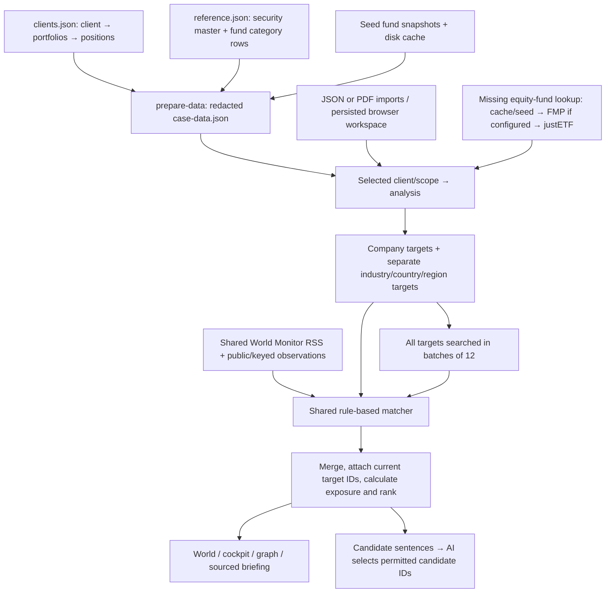

# Portfolio → metadata → news: data-flow audit

## Remediation update — 19 September 2026

The sections below preserve the original audit findings. A subsequent implementation pass repaired metadata preservation and persisted-workspace migration, attached exact-ISIN constituent classifications with source evidence, added direct region/partial country coverage, unified macro exposure arithmetic, and gated policy comparisons on a proven classification/denominator basis. Fund product tags no longer generate underlying-allocation drift actions. Missing or conflicting metadata remains unknown.

Alias-aware RSS retrieval, manual World cache bypass, visible client-search coverage, age-based fund refresh with dated fallback, and upstream sensor identity deduplication are implemented. Dictionary ticker tags can no longer bypass text matching. Identical headlines with a trailing declared publisher are merged.

Latest per-instrument prices are now separate from imported valuations: checksum validation → exact-ISIN provider search → single compatible listing → dated quote/NAV. Ten representative live stock/ETF/fund lookups succeeded, including an OpenFIGI identity fallback for Alphabet where Yahoo's ISIN search was empty; the Joker UI showed 13/15 available prices at verification. Source timestamps, provider listing/currency and stale/unavailable states are explicit. Unsupported/private instruments remain gaps. See README's Instrument quotes and metadata fidelity section for limits and cache behavior.

Original coverage counts below are a snapshot before remediation and before any subsequent source refreshes.

Reviewed 19 September 2026. Read-only audit of application behavior; no production fixes in this pass. Counts describe the prepared case dataset on disk, not any user-imported workspace persisted in a browser. Configuration checks confirm enabled integrations, not current upstream health. Three parallel code traces covered source/exposure metadata, retrieval/matching, and cross-view behavior.

## Conclusion

The original data contains security identity, country, region and industry classifications. The application does not retain or connect all of them. It builds separate company and macro targets, rather than a complete company profile that links an instrument to its country, region and industry. Fund-level category allocations and company constituent snapshots come from different sources and dates.

The previous explanation of verified-ticker matching described a supported code branch, not the effective case-data flow: generated targets currently have no symbols. News relevance is primarily inferred from names and headline terminology.

## Observed coverage

| Layer | Current prepared dataset |
| --- | --- |
| Clients / portfolios / position rows | 47 / 57 / 703 |
| Security master | 504 records; 277 distinct SecurityIds held in portfolios |
| Position-to-master join | All 703 position rows join using SecurityId |
| Held security identity, type, asset and country | Present for all 277 held SecurityIds |
| Held security industry | 122/277; includes 98/102 direct equity securities |
| Held security region in original source | 277/277; both CountryGroupName and SAA_CountryGroupName are discarded in preparation/import |
| Fund category data | 48,101 source rows for 141 fund SecurityIds; observed per-fund totals round to 100 percentage points |
| Held funds | 114 distinct fund SecurityIds: 73 equity, 41 non-equity; category mappings cover 73/114 |
| Held equity-fund company coverage | 47/73 have partial snapshots; 26/73 have none; no held equity snapshot is complete |
| Constituent snapshots | 107 snapshots / 1,070 constituent rows |
| Constituent ISIN | 1,037/1,070 rows; 531 distinct ISINs |
| Constituent country / industry attached | 0 country fields; industry is not in the constituent schema |
| Potential exact constituent/master joins | 69 distinct constituent ISINs, covering 276 row occurrences, have master country and industry data that is not attached |
| Default-scope company news targets | 1,496 occurrences across 47 clients; 1,316 have ISINs; zero have symbols |

Counts of securities are instrument records, not legal issuers. Multiple currency records may share an ISIN; source joins must preserve the SecurityId relationship. Company news aggregation uses ISIN, not an issuer identifier such as LEI.

Four directly held equities lack industry in the original source: Stanserhorn-Bahn, Grand Resort Bad Ragaz, WWZ and Gondelbahn Grindelwald-Maennlichen. This is an actual source gap; missing industries for bonds/funds should not automatically be interpreted as erroneous company profiles.

## End-to-end flow

### 1. Source records and preparation

`unriskomega-2026/core-case/portfolio-data/clients.json` contains holdings under each portfolio: SecurityId, security name, value, quantity and PortfolioValuePercentage. These are the portfolio facts; external news providers do not determine what the client owns.

`reference.json / Securities` supplies the master classifications. `SecurityPositions.SecurityId` joins to `Securities.Id`. The original fields include Name, Isin, SecurityTypeName, IndustryName, CountryName, CountryGroupName and the SAA_* classification family.

`scripts/prepare-data.mjs:10` projects/redacts client records. At line 60 it projects securities, preserving IndustryName and CountryName but dropping CountryGroupName, SAA_CountryGroupName and SAA_IndustryName. JSON reference uploads repeat that loss in `src/lib/import.ts:38`.

`FundUnbundlingMappings` contains category allocations, not named companies. Preparation groups Weight by IndustryName and CountryGroupName for each FundSecurityId. The prepared FundBreakdown keeps sector and region marginal totals; it does not retain raw cross-category rows, asset-class allocations or currency allocations. All four classification columns are populated in the inspected raw rows.

The source documentation distinguishes the plain classifications from the coarser SAA_* policy taxonomy and explicitly calls for SAA_* in policy comparisons (`DATA.md:212`). It also says most export dates are shifted; price/factory-calculation dates are exceptions (`DATA.md:33`). Of 57 portfolios, 55 have FactoryDateUtc values, all on 3 September 2026. They are risk-calculation timestamps, not independently verified evidence of the last position reconciliation.

### 2. Fund company data is a separate source

`data/fund-holdings.json` supplies four seed snapshots. `.cache/fund-holdings/*.json` supplies additional cached snapshots; preparation prefers a newer asOf when the fund ISIN is already present. The current dataset has 103 justETF snapshots and four snapshots labelled UBS/Swiss Fund Data, BlackRock/iShares or State Street. Snapshot dates range from 31 January to 17 September 2026.

At runtime, `src/useFundHoldings.ts:28` automatically attempts missing eligible equity-fund snapshots, with up to four concurrent lookups. `/api/fund-holdings` first chooses a cached/seed snapshot. Without an explicit refresh it returns that snapshot regardless of age. If no snapshot is available, it tries FMP when configured, then justETF. Failures are briefly cached; browser automatic attempts are remembered for the session.

The justETF parser checks the requested fund ISIN, source date, individual weights and published top-holdings total. It returns up to ten names/weights/ISINs. The optional FMP parser also takes ten rows. Downstream calculations now use every row supplied by a snapshot, but the acquisition adapters still supply partial top-ten snapshots.

Neither adapter fills company industry or country. There is no issuer-profile enrichment service in the current flow. A dated source and successful parser are evidence of provenance, not a guarantee that a partial snapshot is current or exhaustive.

### 3. Analysis and exposure derivation

`src/lib/analysis.ts:60` joins positions to the master by SecurityId and attaches fund category data by SecurityId and constituent snapshots by fund ISIN. It assigns:

- identity/name/type from position and master fields;
- asset from SAA_AssetClassName;
- sector from IndustryName;
- country from CountryName;
- no region property on Holding.

Single-portfolio weights use PortfolioValuePercentage. Compatible multi-portfolio weights use that percentage multiplied by portfolio AUM / total selected AUM. Overlapping scopes, incompatible external snapshot currencies/dates, or missing/invalid weights withhold combined exposure calculations.

`src/lib/portfolio.ts:37` derives dimensions separately:

| Exposure | Derivation |
| --- | --- |
| Direct company | Direct equity-like instruments; not every security type |
| Indirect company | Eligible equity fund portfolio weight × constituent weight |
| Direct industry | IndustryName on non-fund security master × holding weight |
| Fund industry | FundUnbundlingMappings sector percentage × fund portfolio weight |
| Direct country | CountryName on non-fund security master × holding weight |
| Fund country | Only fund country-group labels explicitly recognized as Switzerland, UK or Japan; otherwise constituent countries only when no geographic breakdown exists |
| Region | Fund category groups only; direct instruments are omitted |

Partial published constituent weights are not scaled up to 100%. Fund category weights are percentage points; totals within one point of 100 can be normalized for rounding. Company weights are fractions. These dimensions overlap and must not be added together.

The constituent-country fallback currently contributes nothing for the supplied snapshots: none contains country, and no master enrichment fills it. Moreover, all 47 currently covered eligible held equity fund snapshots already have fund breakdowns, so merely attaching country would not activate the fallback.

Bond, property and commodity fund constituents are not treated as operating-company equity exposure. Their credit, property, commodity and counterparty relationships require different data models. A fund's domicile is not substituted for underlying investment geography.

### 4. Imports and persisted workspace

`src/App.tsx:53` loads case-data.json, then uses a saved imported workspace if present. Therefore a user's visible client universe can differ from this audit's on-disk coverage counts.

Client-only JSON imports reuse the active reference. Reference-envelope imports replace projected classifications but retain the existing constituent snapshot library. PDF import (`src/lib/pdfImport.ts:155`) creates statement-derived positions/master rows, copies industry/country when an existing master matches the ISIN, and otherwise leaves them missing. It does not fetch complete company profiles or carry region metadata. This audit inspected these branches; it did not measure a browser's private persisted imports.

### 5. News targets and retrieval

`src/lib/briefing.ts:23` builds companies from direct equity securities and eligible fund constituents, aggregating the same ISIN and retaining observed alternative names. Then it appends independent industry, country and region targets. A company target has identity, name, optional aliases/ISIN/symbol, weight and a text ownership path. It has no country, region or industry fields. Category targets do not carry a structured per-company attribution list into the matcher.

All targets are attempted: `src/lib/loadContext.ts:11` sends batches of twelve, with two batches concurrently. The server's twelve-target cap is a per-batch limit, not a twelve-company portfolio limit.

Configured locally: OpenBB using yfinance, World Monitor, AISstream, EIA and FIRMS. FMP and explicit OpenBB symbol mappings are absent. Credentials remain server-side.

For each company the supported fallback sequence is optional FMP symbol resolution → OpenBB → FMP news → Yahoo name search → Google News RSS. In current configuration, FMP branches are skipped; OpenBB can receive an exact ISIN. The first provider with accepted matches wins. Each target returns at most two ranked headlines; this is screening, not comprehensive news collection. Macro targets use Google RSS.

Queries use the primary cleaned name, not the entire alias list. Successful lookups, including empty results, are cached for fifteen minutes and rebound to the current target. An explicit portfolio refresh bypasses this cache. The target's name/ISIN is sent to the relevant provider; the external news queries do not include client identity or account balances. Full target objects travel to the local Compass API.

### 6. World Monitor and other observations

The browser requests `/api/world-context` with an empty body. The shared World resolver fetches the self-hosted English full RSS digest, accepting at most 100 items/category and 500 total dated articles. Category bucket identity is not retained as a normalized article-industry/region taxonomy. Matching is later performed locally against portfolio targets.

World observations are separate: EIA daily WTI/Brent spot prices; NASA FIRMS NOAA-20 detections (today/yesterday, sampled at 300); AISstream via the World Monitor relay (up to 100 recent tankers, 30-minute freshness); USGS earthquakes; NASA EONET natural events; NGA navigational warnings through World Monitor; chokepoints and Yahoo market benchmarks.

AIS and FIRMS are explicitly barred from portfolio matching. Other sensor layers cannot create company matches. No factory, vessel-owner, supplier, cargo or revenue-geography relationship is inferred. Coordinates are source locations, not locations guessed from held-company names. Pinned World Monitor RSS records generally do not emit article coordinates.

World results, including observations, are cached for five minutes (thirty seconds after unavailable news). The UI refresh does not currently bypass this cache. The 1Y selector filters available results; it does not turn live snapshots/latest RSS into a complete one-year archive.

### 7. Matching, scoring and display

`src/lib/newsMatching.ts:40` applies shared text rules:

- Company: normalized name phrase or known same-instrument alias in title/summary, with acronym and ambiguity guards. No full-article semantic reading.
- Country/region: economic/disruption keyword plus geographic name in headline; country aliases are limited and regions have no alias hierarchy.
- Industry: industry phrase or one of a few hard-coded aliases in headline. No general sector/subsector ontology.
- The ticker-only branch exists, but no generated case target has symbol. Server ISIN/symbol resolution is local to retrieval and is not propagated back into the targets. Pinned World Monitor ticker tags are themselves dictionary-extracted text labels, not independent exchange identity verification.

Articles receive matching target IDs. `src/lib/research.ts` merges duplicate news, restricts links to current targets and recalculates weights. Company matches sum matched instrument weights once. Macro-only World items use the largest matched bucket, which is a display heuristic rather than the union of all economically exposed holdings.

World separates held-company mentions, macro-only matches, and Global (the full universe, including matched items). Ordering favors company matches, possible material events, weight and recency. Pinned context and cached UI results are invalidated when client/scope/targets change.

AI does not create this metadata or ownership connection. The briefing stage sends grounded candidate sentences for permitted-ID selection. Uploaded research is a separate branch with declared source/date and explicit topic matching.

## Prioritized findings still open

1. **High — Available region and policy metadata is discarded.** Preserve both source and SAA taxonomies; populate direct-instrument region exposures. Current cockpit country-to-CountryGroup policy comparisons use partial aliases instead of the supplied SAA classifications.
2. **High — Company metadata is disconnected.** Attach authoritative country/region/industry to company identities, retaining source and classification meaning. Reuse exact master matches first; retrieve missing profiles separately. Do not turn a domicile classification into an operating-exposure claim.
3. **High — Overlapping macro weights are added in the cockpit.** `src/lib/cockpit.ts:67` sums country and region targets. Reproduced with CASE-002 and the fixture headline “Switzerland markets decline”: country=27.4771%, region=27.4771%, World=27.4771%, cockpit=54.9543%. Use one shared per-holding exposure calculation and retain separate dimensions when their union is unknown.
4. **Medium — Missing country detail is hidden behind broad fund regions.** Current precedence prevents constituent-country data from contributing whenever a fund has a regional breakdown. Define explicit complete/partial geography coverage instead of treating these as interchangeable alternatives.
5. **Medium — Stale constituent snapshots can persist indefinitely.** Existing snapshots are not refreshed automatically by age. Display asOf/coverage and set an explicit refresh policy.
6. **Medium — Alias-aware acceptance follows alias-unaware search.** A headline may satisfy the matcher but never be retrieved by the exact primary-name query. Retrieval and matching need the same canonical aliases; regions/subsectors also need an explicit taxonomy.
7. **Medium — World refresh and coverage indicators are incomplete.** Force refresh does not refresh World; World does not show which client-specific searches failed. Surface both provider health and per-target search coverage.
8. **Medium — Distinct sensor records can still collapse upstream.** `src/lib/world.ts:22` deduplicates all incoming records by URL before the repaired merge function. A read-only fixture with two distinct sensor IDs sharing a map URL yields one item. The prior downstream deduplication fix does not cover this earlier stage.
9. **Medium — Symbol support is described more strongly than implemented.** No target symbol propagation exists. Any future use must carry identity provenance and avoid treating dictionary-extracted news tags as independently verified security IDs.

## Repair order

Preserve/classify source metadata first; create a source-backed instrument/company profile and structured contribution paths; attach available constituent profiles; unify exposure arithmetic across views; then improve retrieval aliases, refresh and search coverage. Add regression cases for actual-versus-SAA taxonomies, direct regions, partial constituent geography, cross-view weight equality and upstream sensor identity. Additional providers alone will not repair the missing relationships.

The audit did not certify the real-world accuracy of every issuer classification, historical seed snapshot or live article. It establishes what the supplied files contain and what the current code actually does with them.
